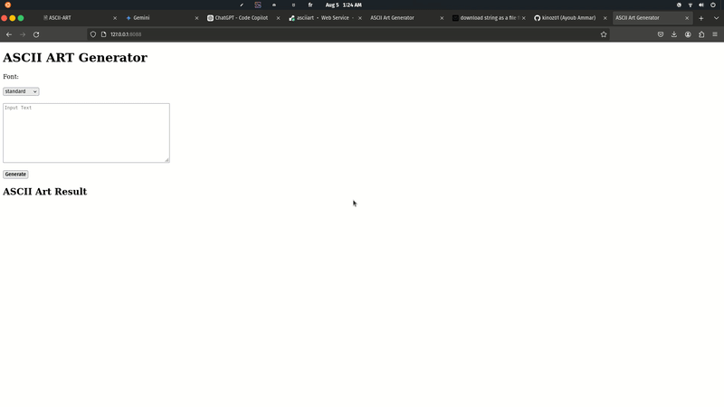

# Description
Ascii Art Generator is a web application that allows users to create ASCII art representations of text through a user-friendly web interface.  
The web application can generates ASCII art representations of input text.  
The program will take a text and render its graphical representation using ASCII characters.

<div align="center">
  
</div>

# How to Use

1. Clone the Repository:

```bash
git clone https://learn.zone01oujda.ma/git/aammar/ascii-art-web
```

2. Run the program or build it:

```bash
go run .
```

or
```bash
go build -o app .
./app
```

3. Access the web app:

Open your web browser and navigate to `http://localhost:8080` to see the Ascii-art-web interface.

> You can also have direct access to the web application [here](https://asciiart-ar9d.onrender.com).