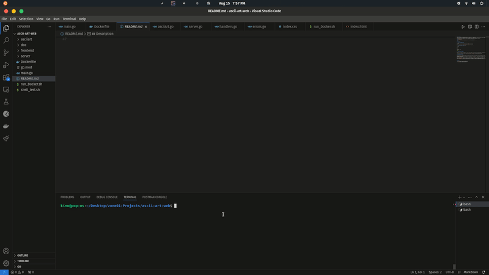

## Description
Ascii Art Generator is a web application that allows users to create ASCII art representations of text through a user-friendly web interface.  
The web application can generates ASCII art representations of input text.  
The program will take a text and render its graphical representation using ASCII characters.

<div align="center">
  
</div>

## How to Use

1. **Clone the Repository:**

```bash
git clone https://learn.zone01oujda.ma/git/aammar/ascii-art-web
```

2. **Run the program or build it:**

```bash
go run .
```

or
```bash
go build -o app .
./app
```

3. **Access the web app:**

Open your web browser and navigate to `http://localhost:8080` to see the Ascii-art-web interface. Just choose your font and click the `Generate` button.

> You can also have direct access to the web application [here](https://asciiart-ar9d.onrender.com).

## Implementation details

The `HomeHandler` manages GET requests to display the main page, which includes a list of available font styles. It parses an HTML template from the embedded file system and populates it with default data, including the available fonts. The `ReadFonts` method scans the embedded font directory to retrieve and list the available font styles for use in generating ASCII art.

The `AsciiArtHandler` handles POST requests to generate ASCII art based on user-provided text and banner style. It extracts the input from the request, validates it, and uses the `asciiart.ASCIIArt` function to produce the art. The handler then renders the updated page with the generated art and any available fonts. Error handling ensures that invalid requests or internal server issues are properly communicated with appropriate HTTP status codes.

## Authors

- [ktrichin](https://github.com/khalidrika)
- [kinoz01](https://github.com/kinoz01)
