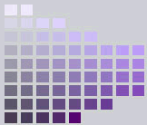

## colors

### Color, Hue, Tint, Tone, and Shade

Many people use terms like “hue” and “color” or “tint” and “shade” interchangeably, but the terms have distinctly different meanings. Color is a very general term used to describe every hue, tint, tone, or shade we can see. Hue refers to the dominant color family.

Hue refers to the origin of the colors we can see. Primary and Secondary colors (Yellow, Orange, Red, Violet, Blue, and Green) are considered hues; however, tertiary colors (mixed colors where neither color is dominant) would also be considered hues.

Tint refers to any hue or mixture of pure colors to which white is added. Pastel colors are generally tinted colors. Tinted color remains the same color, but it is paler than the original. When mixing a tint, always begin with white paint and gradually mix in small amounts of color until you’ve achieved the tint you want.

Tone is a hue or mixture of pure colors to which only pure gray is added (equal amounts of black and white). Adding gray to a color will make the intensity much duller. Beware of mixing too much gray into a hue as it can become over-dulled and virtually impossible to restore the brilliance.

Shade is a hue or mixture of pure colors to which only black is added. It contains no white or gray. Shade darkens the color, but the hue remains the same. When mixing a shade, begin with the color itself then add black one drop at a time. 

> Hue can typically be represented quantitatively by a single number, often corresponding to an angular position around a central or neutral point or axis on a color space coordinate diagram (such as a chromaticity diagram) or **color wheel**, or by its dominant wavelength or by that of its complementary color. 

[source](https://www.beachpainting.com/blog/color-hue-tint-tone-and-shade/)

<div align="center">
  
</div>

This is a Munsell constant hue chart — a slice or a plane of the Munsell color solid.

Here the **Hue is purple**.
There are 60+ colors here, but all of them are purple-hued colors.

**Chroma changes from left-to-right**  
Low chroma colors are on the left...  
mid-chroma colors near the center...  
high chroma colors on the right.  

**Value changes from bottom-to-top:**  
Low values (shades) near the bottom  
High values (tints) near the top. 


### hsl to rgb

**Understanding HSL**

> Hue: The base color, represented as an angle on a color wheel (0° = red, 120° = green, 240° = blue).

>Saturation: The intensity or vividness of the color (0% = gray, 100% = fully saturated).

> Lightness: How bright or dark the color is (0% = black, 50% = normal, 100% = white).


**Conversion Steps**
First we ensure values are within valid ranges (0-360 for hue, 0-100 for saturation/lightness).
```go
if h_i < 0 || h_i > 360 || s_i < 0 || s_i > 100 || l_i < 0 || l_i > 100 || err1 != nil || err2 != nil || err3 != nil {
		return ""
	}
```

1. **Normalize H, S, L**: Convert the percentage values of S and L to the range [0, 1].

```go
h, s, l := float64(h_i)/360, float64(s_i)/100, float64(l_i)/100
```

2. **Chroma Calculation**:

```go
c := (1 - math.Abs(2*l-1)) * s
```

Chroma represents the colorfulness of the HSL color. It's calculated using the lightness and saturation values. Higher chroma means a more vibrant color, while lower chroma leans towards gray.

> Chroma (`c`) represents the colorfulness or intensity of the color. It's a measure of how far the color is from gray.

> When lightness is either 0 (black) or 1 (white), the color is essentially a shade of gray. Gray has no hue and no saturation, meaning it is completely neutral and lacks any colorfulness. Since chroma measures colorfulness, it must be 0 for any shade of gray.

- `|2 * l - 1|`: This term represents the absolute distance of the lightness (`l`) value from `0.5 `(the middle gray). It ranges from 0 to 1.
    - When `l` = 0.5 (middle gray), this term becomes 0.
    - When `l` = 0 (black) or `l = 1` (white), this term becomes 1.
- `(1 - |2 * l - 1|)`: This term inverts the distance. It also ranges from 0 to 1.
    - When `l = 0.5`, this term becomes 1.
    - When `l = 0 `or `l = 1`, this term becomes 0.
- `s`: Saturation ranges from 0 (grayscale) to 1 (fully saturated).

> The maximum chroma is 1, meaning the color is fully saturated and as far away from any gray shade as possible.   
This maximum chroma can be achieved with any hue value, as long as the lightness is 0.5 and saturation is 1.

3. **Intermediate Value `x`**:

```go
x = c * (1 - math.Abs(math.Mod(h*6, 2)-1))
```

This calculates an intermediate value (`x`) that determines how much of the secondary color is present. It depends on the hue, which essentially defines the position on the color wheel.

- When the hue is at the edge of a sector (e.g., h = 0, h = 120, h = 240, and 360), the secondary color has no contribution (`x = 0`), and the color is purely the dominant primary and in case of a max chroma (c = 1 therefore s = 1 and l = 0.5) we are talking about pure foundamental colors: red, green and blue.

- As the hue moves towards the center of a sector(e.g., h = 60, h = 180, h = 300), the secondary color's contribution increases (x approaches 1).

4. **Minimum Value `m`**:

```go
m = l - c/2
```
This calculates the minimum value (`m`) for the RGB components, which is influenced by the lightness. Lower lightness values result in darker colors, thus increasing `m`.

`m` represents the minimum value for the RGB components (red, green, and blue). It is used to determine the baseline intensity of all three primary colors in the final RGB representation.

The key principle is that the lightness (L) of a color is essentially the average of the maximum (max) and minimum (min) RGB values:

```go
l = (max + min) / 2
```

> By averaging the max and min values, we get a value that represents the middle point between the lightest and darkest parts of the color.

Similarly, the *chroma (C)* represents the difference between the maximum and minimum RGB values:

```go
c = max - min
```

We can rearrange these equations to express max and min in terms of `l` and `c`:

```go
max = L + C/2
min = L - C/2
```

This is where `m` comes into play. In the HSL to RGB conversion, we first calculate preliminary RGB values (`r64`, `g64`, `b64`) that depend on the hue and chroma. These values might not be within the correct range for the desired lightness. To fix this, we add `m` to all three preliminary values, which effectively shifts them.

Adding `m` to all three RGB values is essential to maintain the hue. If we were to adjust only one or two components, we would risk altering the color's hue. By adding `m` to all of them, we shift the entire color towards brighter or darker shades without changing its hue.

5. **Hue-Based RGB Sector Selection**:

  - The `switch` statement divides the hue into six sectors, each representing a 60° range on the color wheel.
  - Based on the hue, it sets the appropriate primary (`c`) and secondary (`x`) colors for that sector. The third color is always 0 in this case.

> The core idea is that the dominant primary color should have the highest intensity to accurately represent the chosen hue. By assigning the chroma value to the dominant primary, we ensure that the color's intensity is at its maximum potential for that specific hue.


https://bootcamp.uxdesign.cc/hsl-triumphs-embracing-the-brilliance-beyond-rgb-df3348b9fc54


https://filmentor.academy/en/blogs/news/die-wunderbare-welt-der-mathematik-fur-farben

https://en.m.wikipedia.org/wiki/Hue

https://en.m.wikipedia.org/wiki/HSL_and_HSV#HSL_to_RGB

https://www.baeldung.com/cs/convert-color-hsl-rgb

https://medium.com/swlh/converting-between-color-models-5cb7e2d12e10

https://hslpicker.com/#ff0
https://csunplugged.jp/csfg/data/interactives/rgb-mixer/index.html
