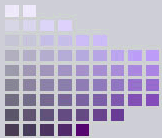

## colors

### Color, Hue, Tint, Tone, and Shade

Many people use terms like “hue” and “color” or “tint” and “shade” interchangeably, but the terms have distinctly different meanings. Color is a very general term used to describe every hue, tint, tone, or shade we can see. Hue refers to the dominant color family.

Hue refers to the origin of the colors we can see. Primary and Secondary colors (Yellow, Orange, Red, Violet, Blue, and Green) are considered hues; however, tertiary colors (mixed colors where neither color is dominant) would also be considered hues.

Tint refers to any hue or mixture of pure colors to which white is added. Pastel colors are generally tinted colors. Tinted color remains the same color, but it is paler than the original. When mixing a tint, always begin with white paint and gradually mix in small amounts of color until you’ve achieved the tint you want.

Tone is a hue or mixture of pure colors to which only pure gray is added (equal amounts of black and white). Adding gray to a color will make the intensity much duller. Beware of mixing too much gray into a hue as it can become over-dulled and virtually impossible to restore the brilliance.

Shade is a hue or mixture of pure colors to which only black is added. It contains no white or gray. Shade darkens the color, but the hue remains the same. When mixing a shade, begin with the color itself then add black one drop at a time. 

> Hue can typically be represented quantitatively by a single number, often corresponding to an angular position around a central or neutral point or axis on a color space coordinate diagram (such as a chromaticity diagram) or **color wheel**, or by its dominant wavelength or by that of its complementary color. 

[source](https://www.beachpainting.com/blog/color-hue-tint-tone-and-shade/)

  

This is a Munsell constant hue chart — a slice or a plane of the Munsell color solid.

Here the **Hue is purple**.
There are 60+ colors here, but all of them are purple-hued colors.

**Chroma changes from left-to-right**  
Low chroma colors are on the left...  
mid-chroma colors near the center...  
high chroma colors on the right.  

**Value changes from bottom-to-top:**  
Low values (shades) near the bottom  
High values (tints) near the top. 

### hsl to rgb

**Understanding HSL**

- **Hue (H)**: Represents the color's position on the color wheel, expressed in degrees (0° to 360°). Red is 0°, green is 120°, and blue is 240°.
- **Saturation (S)**: Describes the intensity or vividness of the color (0% to 100%). 0% is grayscale, and 100% is the purest color.
- **Lightness (L)**: Indicates how bright or dark the color is (0% to 100%). 0% is black, 50% is the "normal" color, and 100% is white.

**Conversion Steps**

